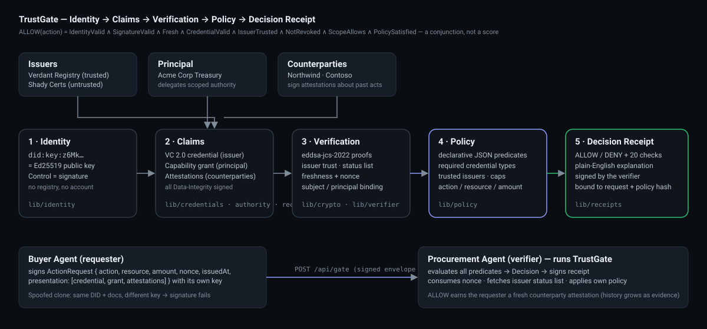

# TrustGate — The Agent That Earns Trust

> **TLS for agent behaviour.** Before one agent acts on another's request it verifies *who* is asking (key-bound identity), *what trusted issuers say about them* (signed credentials, not revoked), *what their principal actually delegated* (scoped, time-boxed authority), *what counterparties have signed about them* (attestations), and *whether the request is fresh* — then applies its **own** policy. The answer is **ALLOW** or **DENY** with the exact evidence that caused it.
>
> **Trust is not a score.** It is a conjunction of verifiable predicates.

**Repo:** https://github.com/abomalek11-prog/trustgate · **Live demo:** _pending_ (no login) · **Loom:** _…_ · **Submission notes:** [docs/submission-notes.md](docs/submission-notes.md)

```
ALLOW(action) = IdentityValid ∧ SignatureValid ∧ Fresh ∧ CredentialValid ∧ IssuerTrusted
              ∧ NotRevoked ∧ ScopeAllows(action, resource, amount, time) ∧ PolicySatisfied
```



---

## Table of contents

1. [The 90-second demo](#the-90-second-demo)
2. [The trust model](#the-trust-model-evidence--authority--policy)
3. [What a decision looks like](#what-a-decision-looks-like)
4. [Architecture](#architecture)
5. [Attack Lab — failure thinking](#attack-lab--failure-thinking)
6. [Quick start](#quick-start)
7. [HTTP API (cross-agent over the wire)](#http-api-cross-agent-over-the-wire)
8. [Deployment](#deployment)
9. [Repository layout](#repository-layout)
10. [Security model & limitations](#security-model--limitations)
11. [Standards](#standards)
12. [Judging criteria → implementation](#judging-criteria--implementation)
13. [Two-year thesis](#two-year-thesis)
14. [Submission notes](#submission-notes)

---

## The 90-second demo

Full script with timings: [docs/demo-script.md](docs/demo-script.md).

| | Action | Result |
| --- | --- | --- |
| 1 | **Buyer Agent** asks **Procurement Agent** to purchase **$250** of API credits. | 20/20 predicates pass → **ALLOW**, verifier signs a receipt, the Buyer earns a new counterparty attestation. |
| 2 | **Spoofed Buyer Agent** — a clone with the Buyer's DID, credential, grant and attestations copied byte-for-byte — sends the same request. | `REQUEST_SIGNATURE_VALID` fails (it does not hold the private key) → **DENY**. Everything it copied still verifies; it simply cannot prove control. |
| 3 | The genuine **Buyer Agent** asks for **$2,000** against a **$500** delegation. | Identity ✓ credential ✓ revocation ✓ … `AUTHORITY_AMOUNT_WITHIN_GRANT` fails → **DENY**. *Valid identity does not mean unlimited authority.* |
| 4 | Open the **Policy Editor**, lower the verifier cap to $200 — or tick *Shady Certs* as a trusted issuer. | The last decision re-runs instantly and flips. *Trust is local to the verifier's policy.* |

Everything above is real: the engine runs **in your browser**, and every signature in the trace was verified by `@noble/ed25519` milliseconds before you saw it.

## The trust model: evidence ∧ authority ∧ policy

An agent's trust profile has four **separate** evidence classes. None of them is a number.

| Evidence class | Question it answers | Artifact | Who signs |
| --- | --- | --- | --- |
| **Identity** | Who controls this agent? | `did:key` — the identifier *is* the Ed25519 public key. Control = a signature over the request. | the agent |
| **Credentials** | What has a trusted issuer verified about it? | W3C VC 2.0 `VerifiedBusinessAgent` with a Data Integrity proof and a `credentialStatus` pointer into an issuer-signed status list. | an issuer |
| **Authority** | What may it actually do, within what limits? | Capability grant with RFC 9396-style `authorizationDetails`: actions, resource patterns, `maxAmount`, validity window. | the principal (owner) |
| **Behavioral evidence** | What have counterparties signed about its past actions? | Attestations and decision receipts, each individually verified and *counted* — never averaged into a score. | counterparties / verifiers |

The receiving agent evaluates **20 predicates** across nine stages — identity → signature → freshness → credential → issuer → revocation → authority → history → policy — and ALLOWs only if every required predicate holds. Attestations can be *required* by policy (`minVerifiedAttestations`) but can never compensate for a failed identity, credential, revocation or authority check. That invariant has its own test file: [`tests/reputation-cannot-bypass.test.ts`](tests/reputation-cannot-bypass.test.ts).

## What a decision looks like

```jsonc
{
  "allow": false,
  "decision": "DENY",
  "policyId": "procurement-purchase-v1",
  "policyHash": "sha256:e93acff88c…",          // hash of the exact policy used
  "verifier": "did:key:z6MkrbnW…",
  "subject":  "did:key:z6MkiH6n…",
  "action": "purchase", "resource": "vendor:northwind/api-credits",
  "amount": { "value": 2000, "currency": "USD" },
  "requestId": "urn:uuid:…", "requestHash": "sha256:af737d9f…",
  "checks": [
    { "id": "IDENTITY_RESOLVED",           "stage": "identity",  "status": "pass", "critical": true, "detail": "Buyer Agent (did:key:z6Mk…g36tjZ) resolves to Ed25519 key a970e380bba56168; proof names that key.", "evidence": { "from": "did:key:…", "keyFingerprint": "a970e380bba56168" } },
    { "id": "REQUEST_SIGNATURE_VALID",     "stage": "signature", "status": "pass", "…": "…" },
    { "id": "CREDENTIAL_NOT_REVOKED",      "stage": "revocation","status": "pass", "detail": "Issuer-signed status list (published 2026-09-01T00:00:00Z) shows index 42 not revoked" },
    { "id": "AUTHORITY_AMOUNT_WITHIN_GRANT","stage": "authority","status": "fail", "detail": "Requested $2,000 EXCEEDS the delegated cap of $500. Identity and credential are valid, but the principal never authorized this much." },
    "… 16 more …"
  ],
  "failedChecks": [ "AUTHORITY_AMOUNT_WITHIN_GRANT", "POLICY_AMOUNT_WITHIN_LIMIT", "POLICY_SATISFIED" ],
  "explanation": "DENY — Identity and credential are valid, but the requested $2,000 exceeds the $500 the principal authorized. Valid identity does not mean unlimited authority. …",
  "evidence": { "credentialIds": ["urn:uuid:…"], "grantIds": ["urn:uuid:…"], "attestationIds": ["…","…"], "statusListIds": ["https://verdant.example/status/1"], "issuerDids": ["did:key:z6MktNm2…"], "principalDids": ["did:key:z6MkmCH2…"] },
  "timestamp": "2026-10-01T12:00:00.000Z",
  "durationMs": 9,
  "receipt": { "type": ["DecisionReceipt"], "verifier": "did:key:z6MkrbnW…", "decision": "DENY", "requestHash": "sha256:…", "policyHash": "sha256:…", "proof": { "type": "DataIntegrityProof", "cryptosuite": "eddsa-jcs-2022", "proofValue": "z…" } }
}
```

Every decision — ALLOW *and* DENY — is signed by the verifier and bound to the request hash and the policy hash, so it can be audited later by anyone.

## Architecture

**Identity → Claims → Verification → Policy → Decision Receipt** — see [docs/architecture.md](docs/architecture.md) (with a sequence diagram) and the in-app `/architecture` page.

```
lib/
  crypto/        Ed25519 (@noble), SHA-256, RFC 8785 JCS, W3C Data Integrity eddsa-jcs-2022 — ONE sign/verify pair for everything
  identity/      did:key encode / resolve / DID Document; resolver rejects foreign key fragments
  credentials/   VC 2.0 issue + granular verify; signed Bitstring-style status lists (revocation)
  authority/     principal-signed capability grants (actions, locations, maxAmount, validity)
  requests/      the signed ActionRequest envelope (nonce, issuedAt/expiresAt, presentation)
  receipts/      counterparty attestations + verifier-signed decision receipts
  policy/        declarative Policy, 20 predicates + metadata, engine → Decision, explanation
  verifier/      the receiving agent's gate: nonce cache, status-list view, receipt signing
  demo/          deterministic synthetic actors, Attack Lab scenarios, "earns trust" loop
app/ + components/   Console · Verification Trace · Decision Card · Attack Lab · Policy Editor · JSON drawer · Agent Directory · Trust Profile · Architecture
app/api/             the same engine over HTTP
tests/               80+ tests, one file per attack class
```

The UI is a thin shell around the real engine: the same `lib/` code runs in the browser (demo), in the API routes (`curl`) and in the test suite.

## Attack Lab — failure thinking

Each button in the Attack Lab builds a **real signed request** (or performs a real issuer/verifier state change) and runs it through the real verifier. Every scenario is also a test.

| Scenario | What the attacker does | Predicate that denies it |
| --- | --- | --- |
| Spoofed identity | Copies the Buyer's DID + all public documents, signs with own key | `REQUEST_SIGNATURE_VALID` |
| Tampered credential | Edits `credentialSubject` after issuance, re-signs the envelope | `CREDENTIAL_SIGNATURE_VALID` |
| Forged authority | Rewrites the grant cap $500 → $5,000 | `AUTHORITY_SIGNATURE_VALID` |
| Revoked credential | Issuer publishes a re-signed status list with bit 42 set | `CREDENTIAL_NOT_REVOKED` |
| Over-scope amount | Genuine agent asks $2,000 against $500 | `AUTHORITY_AMOUNT_WITHIN_GRANT` |
| Untrusted issuer | Valid credential from *Shady Certs Ltd* | `CREDENTIAL_ISSUER_TRUSTED` (valid ≠ trusted) |
| Replayed request | Identical envelope sent twice | `NONCE_UNSEEN` |
| Stale request | Envelope signed 5 minutes ago | `REQUEST_FRESH` |
| Expired delegation | Presents last half-year's grant | `AUTHORITY_VALIDITY_WINDOW` |
| Identity without authority | Verified identity, no grant | `AUTHORITY_PRESENT` |
| Borrowed credential | Rogue presents the Buyer's valid VC + grant | `CREDENTIAL_PRESENT` / `AUTHORITY_PRESENT` |

Full threat table incl. issuer impersonation, status-list forgery, cross-verifier replay and algorithm confusion: [docs/security-model.md](docs/security-model.md).

## Quick start

Requirements: Node ≥ 20.19 (tested on 24), npm.

```bash
npm install
npm run dev          # http://localhost:3000
```

```bash
npm test             # vitest — 80+ tests, every attack class
npm run check        # typecheck + lint + test
npm run seed         # regenerate data/demo-fixtures.json (byte-identical every run)
npm run build && npm start
```

No `.env` is required. [`.env.example`](.env.example) lists two optional, presentation-only variables. **There are no secrets anywhere in this repo**: every demo key is derived from `SHA-256("trustgate-demo-v1:" + label)` (see [`lib/demo/seeds.ts`](lib/demo/seeds.ts)), which makes the fixtures deterministic and makes it impossible to mistake them for real credentials.

## HTTP API (cross-agent over the wire)

The verifier is also an endpoint. Build a freshly signed request for a scenario and pipe it into the gate:

```bash
HOST=http://localhost:3000
# legitimate $250 purchase -> ALLOW
curl -s "$HOST/api/demo/request?scenario=valid"   | curl -s -X POST -H 'content-type: application/json' -d @- "$HOST/api/gate" | jq '{decision, failedChecks: [.failedChecks[].id], explanation}'
# spoofed clone -> DENY
curl -s "$HOST/api/demo/request?scenario=spoofed" | curl -s -X POST -H 'content-type: application/json' -d @- "$HOST/api/gate" | jq '{decision, failedChecks: [.failedChecks[].id]}'
# genuine buyer, $2,000 -> DENY
curl -s "$HOST/api/demo/request?scenario=valid&amount=2000" | curl -s -X POST -H 'content-type: application/json' -d @- "$HOST/api/gate" | jq .decision
```

| Endpoint | Purpose |
| --- | --- |
| `POST /api/gate` | `{ request, policy?, dryRun? }` → structured `Decision` with signed receipt. `x-trustgate-decision` header carries ALLOW/DENY. |
| `GET /api/demo/request?scenario=…&amount=…` | A freshly signed `ActionRequest` for any stateless scenario (`valid`, `spoofed`, `overscope`, `tampered`, `forged-grant`, `untrusted-issuer`, `stale`, `expired-grant`, `no-authority`, `borrowed-credential`). Replay = POST the same body twice. |
| `POST /api/demo/revoke` | `{ credentialId, revoked }` → issuer re-signs its status list. |
| `GET/POST /api/demo/scenarios` | List / run Attack Lab scenarios server-side. |
| `GET /api/agents`, `GET /api/agents/:slug` | Directory and Trust Profiles (public data only). |
| `GET/PUT /api/policy` | Read / replace the verifier's policy. |
| `GET /api/demo/fixtures` | The live public evidence bundle. |

Server-side state (nonce cache, revocation flags) is per process — fine for a demo, best-effort on serverless; the browser console is the canonical stateful path.

## Deployment

Any Node host works; there is nothing to configure.

**Vercel (recommended)**

```bash
npm i -g vercel
vercel            # preview
vercel --prod     # production
```

or import the repository in the Vercel dashboard — framework preset *Next.js*, no environment variables needed. Optionally set `NEXT_PUBLIC_REPO_URL` so the header links to your repo.

**Anywhere else:** `npm run build && npm start` (listens on `PORT`, default 3000). A `Dockerfile`-free deploy on Render/Fly/Railway with those two commands works unchanged.

## Repository layout

```
app/                 Next.js App Router: pages + API routes
components/          UI (console, trace, decision card, attack lab, policy editor, agents, architecture)
lib/                 the engine — see Architecture above
tests/               vitest: crypto, valid-flow, spoofing, tampering, revocation, overscope,
                     untrusted-issuer, replay, expired-authority, policy-editor,
                     reputation-cannot-bypass, scenarios, fixtures, api, thesis
data/demo-fixtures.json   deterministic public fixtures (regenerated by `npm run seed`)
docs/                architecture.md · architecture.svg · security-model.md · demo-script.md · submission-notes.md · thesis.md
scripts/             seed-demo.ts · write-thesis.ts
```

## Security model & limitations

Summarised; full detail in [docs/security-model.md](docs/security-model.md).

* **One proof suite everywhere.** Credentials, grants, requests, attestations, receipts and status lists all use Data Integrity `eddsa-jcs-2022` (JCS → SHA-256 → Ed25519). One signing path, one verification path.
* **Fail closed.** Missing/unsigned/wrong-issuer status list, unresolvable key, unsupported cryptosuite, malformed proof → DENY.
* **No short-circuiting, no silent passes.** All 20 predicates run; dependents with nothing to evaluate are reported `skip`, never `pass`.
* **Authority is bound to attested control** (`grant.principal === credentialSubject.controller`) and to the agent (`grant.agent === from`).
* **Replay:** 128-bit nonce + `issuedAt`/`expiresAt`; nonces are consumed only for authentic envelopes.
* **Audience binding:** `request.to` must be the verifier.

Limitations, stated plainly: demo keys are public-derivable by design; `did:key` only (no rotation); status list is an uncompressed subset; JSON-LD expansion is not performed (documents are JCS-canonicalized, which is what `eddsa-jcs-2022` is for); no encryption or selective disclosure; API state is per-instance.

## Standards

| Standard | Used for | Code |
| --- | --- | --- |
| [W3C DID Core](https://www.w3.org/TR/did-core/) — `did:key` | Agent, issuer, principal identifiers; DID Documents | `lib/identity/` |
| [W3C Verifiable Credentials 2.0](https://www.w3.org/TR/vc-data-model-2.0/) | Credential shape: `@context`, `type`, `issuer`, `validFrom/Until`, `credentialSubject`, `credentialStatus` | `lib/credentials/` |
| [W3C Data Integrity — EdDSA cryptosuites](https://www.w3.org/TR/vc-di-eddsa/) `eddsa-jcs-2022` | Every proof | `lib/crypto/data-integrity.ts` |
| [W3C Bitstring Status List](https://www.w3.org/TR/vc-bitstring-status-list/) (subset) | Revocation | `lib/credentials/status-list.ts` |
| [RFC 9396](https://www.rfc-editor.org/rfc/rfc9396) OAuth 2.0 Rich Authorization Requests | `authorizationDetails` in capability grants | `lib/authority/` |
| [RFC 8785](https://www.rfc-editor.org/rfc/rfc8785) JSON Canonicalization Scheme | Byte-stable signing input (implemented with the RFC test vector) | `lib/crypto/canonicalize.ts` |
| [RFC 8725](https://www.rfc-editor.org/rfc/rfc8725) JWT BCP (principles) | Audience check, algorithm pinning, freshness, fail-closed | `lib/policy/engine.ts` |

Cryptography: [`@noble/ed25519`](https://github.com/paulmillr/noble-ed25519) and [`@noble/hashes`](https://github.com/paulmillr/noble-hashes) (audited, maintained). No primitives are implemented here.

## Judging criteria → implementation

| Criterion | Weight | Where it is met |
| --- | --- | --- |
| **Conceptual clarity** — trust model is coherent, not just a score | 25 | Four evidence classes + formula (this README, `/architecture`, the pipeline strip on every page). Every decision lists its predicates. "Reputation" is a *count of verified attestations* and is tested to be unable to bypass anything. |
| **Technical depth** — real signing/verification | 25 | Ed25519 via `@noble`; `did:key`; VC 2.0 + `eddsa-jcs-2022` proofs on **six** object types; issuer-signed status lists; principal-signed scoped grants; nonce + timestamp replay defense; audience binding; issuer trust; 80+ tests incl. the RFC 8785 vector. |
| **Demo quality** — decision visible and explainable in 90 s | 20 | Same $250 purchase flips ALLOW → DENY by switching requester or amount; large stamped decision card; animated 9-stage trace; one-sentence explanation; *Why?* and *Raw JSON*; [demo script](docs/demo-script.md). |
| **Failure thinking** — concrete, defended attack | 15 | Attack Lab: 11 executable attacks (spoof, tamper, forge, revoke, over-scope, untrusted issuer, replay, stale, expired, no-authority, borrowed) each with its own test; [threat model](docs/security-model.md). |
| **Future thesis** | 15 | [Two-year thesis](#two-year-thesis) (269 words) — identity is self-certifying, reputation is signed evidence, authority is delegated, trust stays local to verifier policy. |
| **Bonus: standards** | + | DIDs, VC 2.0, Data Integrity, Bitstring Status List, RFC 9396, RFC 8785 — used, not name-dropped. |
| **Bonus: cross-agent** | + | Two agents with distinct keys exchange a signed envelope (in-browser and over HTTP via `/api/gate`); the verifier's receipt and attestation flow back into the requester's profile. |

## Two-year thesis

Over the next two years, agent identity will split into three layers: cryptographic identity, portable evidence, and local trust policy.

A durable agent identity should not be a username owned by one platform. It should be a key-bound identifier that can prove control: the identifier is the public key, and control is a signature. Reputation should not be a global score either; it should be a collection of signed, contextual claims and receipts — who observed what, under which conditions, and when. Authority must remain separate from reputation. A highly reputable agent still should not be able to spend money, access a dataset, or sign a contract unless a principal explicitly delegated that capability within clear constraints: action, resource, amount, time.

The winning trust layer will therefore look less like a social rating system and more like a programmable verification fabric. Agents present credentials and capability grants; counterparties verify signatures, status, freshness, provenance, and scope; then each verifier applies its own policy. This keeps trust interoperable without forcing everyone to agree on one universal definition of "good." Revocation is a signed artifact, not a support ticket. Every decision leaves a signed receipt, so trust compounds as evidence rather than as a number that can be gamed.

At scale, the valuable primitive is not "Agent X has score 92." It is: "Agent X controls this identity, these issuers attest these facts, this principal delegated this authority until this time, these counterparties signed these receipts, and my policy accepts that evidence for this exact action." That model crosses companies, frameworks, and agent runtimes while staying explainable, revocable, and resistant to spoofing.

*(269 words — single source of truth in [`lib/thesis.ts`](lib/thesis.ts), length-checked by a test.)*

## Submission notes

See [docs/submission-notes.md](docs/submission-notes.md) — what to look at, AI tools used, key decisions, out of scope.

## License

MIT — see [LICENSE](LICENSE).
