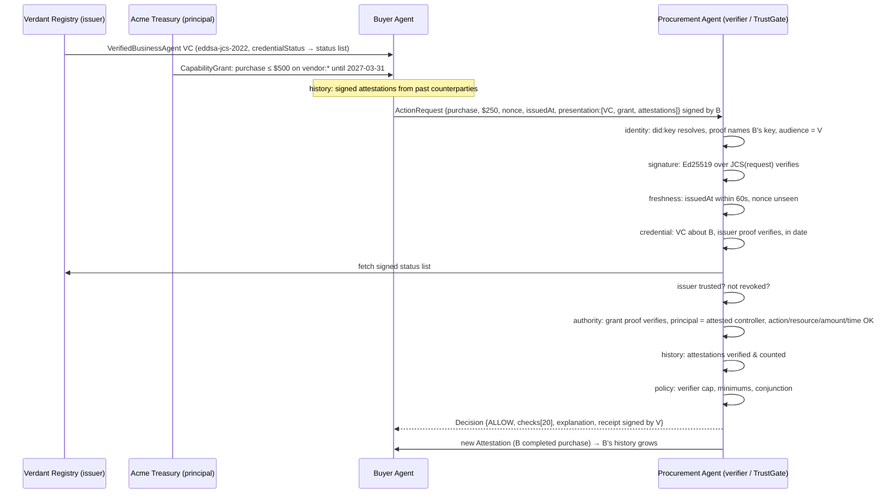

# TrustGate architecture

**Identity → Claims → Verification → Policy → Decision Receipt**


## Trust decision

```
ALLOW(action) = IdentityValid
              ∧ SignatureValid
              ∧ Fresh                       (timestamp window + one-time nonce)
              ∧ CredentialValid             (issuer proof, subject binding, validity window)
              ∧ IssuerTrusted               (verifier-local list)
              ∧ NotRevoked                  (issuer-signed status list)
              ∧ ScopeAllows(action, resource, amount, time)   (principal-signed grant)
              ∧ PolicySatisfied             (verifier's own caps and minimums)
```

A conjunction, not a weighted sum. Verified counterparty attestations are
reported as evidence and can be *required* by policy, but they can never
compensate for a failed identity, credential, revocation or authority check
(`tests/reputation-cannot-bypass.test.ts`).

## Layers and modules

| Layer | Module | Responsibility |
| --- | --- | --- |
| Crypto | `lib/crypto/` | Ed25519 (`@noble/ed25519`), SHA-256, RFC 8785 JCS, W3C Data Integrity `eddsa-jcs-2022` proofs. One `signDocument` / `verifyDocument` pair for every signed object. |
| Identity | `lib/identity/` | `did:key` encode/resolve, DID Document, verification-method → public-key resolver that rejects foreign fragments. |
| Credentials | `lib/credentials/` | VC 2.0 issuance and granular verification; signed Bitstring-style status lists for revocation. |
| Authority | `lib/authority/` | Principal-signed capability grants with RFC 9396-style `authorizationDetails` (actions, locations, `maxAmount`, counterparties, validity). |
| Requests | `lib/requests/` | The signed `ActionRequest` envelope that crosses between agents (nonce, issuedAt/expiresAt, presentation). |
| Receipts | `lib/receipts/` | Counterparty attestations and verifier-signed decision receipts. |
| Policy | `lib/policy/` | Declarative policy type, 20 predicates with metadata, the engine that produces a structured `Decision`, plain-English explanation. |
| Verifier | `lib/verifier/` | The receiving agent's gate: nonce cache, status-list view, receipt signing. |
| Demo | `lib/demo/` | Deterministic synthetic actors, Attack Lab scenarios, the "earns trust" outcome loop, public export. |
| UI | `app/`, `components/` | Console, trace, decision card, Attack Lab, Policy Editor, JSON drawer, Agent Directory, Trust Profile, Architecture. |
| API | `app/api/` | `/api/gate` and friends — the same engine over HTTP for curl-able cross-agent demos. |
| Tests | `tests/` | 80+ tests: crypto primitives, valid flow, every attack class, policy editing, API routes, fixture determinism, thesis length. |

## Cross-agent interaction



## The signed message on the wire

```jsonc
{
  "@context": ["https://trustgate.dev/ns/v1"],
  "type": ["ActionRequest"],
  "id": "urn:uuid:…",
  "from": "did:key:z6MkiH6n…",           // requester (claims to be)
  "to": "did:key:z6MkrbnW…",             // verifier (audience)
  "action": "purchase",
  "resource": "vendor:northwind/api-credits",
  "params": { "amount": { "value": 250, "currency": "USD" }, "description": "25 API credits" },
  "nonce": "…128-bit…",
  "issuedAt": "2026-10-01T12:00:00.000Z",
  "expiresAt": "2026-10-01T12:01:00.000Z",
  "presentation": { "credentials": [VC], "grants": [CapabilityGrant], "attestations": [Attestation…] },
  "proof": { "type": "DataIntegrityProof", "cryptosuite": "eddsa-jcs-2022", "verificationMethod": "did:key:z6MkiH6n…#z6MkiH6n…", "proofPurpose": "authentication", "created": "…", "proofValue": "z…" }
}
```

## Where state lives

* **Browser demo (canonical):** the whole world — keys, verifier, nonce cache,
  issuer status lists — lives in the judge's browser. Every signature shown in
  the trace was verified there, milliseconds earlier, by `@noble/ed25519`.
* **API routes:** a per-process server world (`lib/server/world.ts`). On
  serverless hosts the nonce cache and revocation flags are per-instance and
  best-effort; the endpoints exist so the interaction can be reproduced with
  `curl` and so the engine demonstrably runs identically on the server.
* **Fixtures:** `data/demo-fixtures.json` is regenerated byte-for-byte by
  `npm run seed`; a test asserts the committed file matches the engine.

## Design decisions

* **One proof suite everywhere.** Credentials, grants, requests, attestations,
  receipts and status lists all use `eddsa-jcs-2022`, so there is exactly one
  signing path to audit and one verification path to trust.
* **No short-circuiting.** All 20 predicates run on every request, so a judge
  can see "identity ✓, credential ✓, amount ✗" rather than just "denied".
  Dependent checks with nothing to evaluate are reported as `skip`, never `pass`.
* **Fail closed.** Missing status list, unsigned status list, list signed by
  the wrong issuer, unresolvable key, unsupported cryptosuite — all deny.
* **Authority is bound to attested control.** The grant's `principal` must
  equal the `controller` the issuer attested in the credential; otherwise
  anyone could "delegate" anything to anyone.
* **Nonces are consumed only for authentic envelopes**, so an attacker cannot
  burn a victim's nonce with a forged request.
* **Receipts for every decision.** DENYs are auditable too. Only ALLOWs earn
  the requester a new counterparty attestation.
